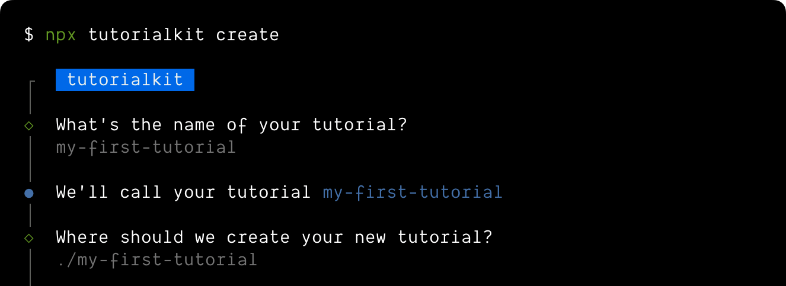

import PackageManagerTabs from '@components/Tabs/PackageManagerTabs.astro'

#### Prerequisites

- **Node.js** - `v18.18.0` or higher.
- **Code editor** - We recommend [StackBlitz](https://stackblitz.com) or [VS Code](https://code.visualstudio.com/).
- **Terminal** - TutorialKit scaffolding script is accessed through a command-line interface (CLI).

## 1. Installation

Run the following command in your terminal to start the install wizard:
<PackageManagerTabs>
  <Fragment slot="npm">
  ```shell
  # create a new project with npm
  npm create tutorial
  ```
  </Fragment>
  <Fragment slot="pnpm">
  ```shell
  # create a new project with pnpm
  pnpm create tutorial
  ```
  </Fragment>
  <Fragment slot="yarn">
  ```shell
  # create a new project with Yarn
  yarn create tutorial
  ```
  </Fragment>
</PackageManagerTabs>

You can run this command anywhere on your machine, so there's no need to create a new empty directory for your project before you begin. If you don't have an empty directory yet for your new project, the wizard will help create one for you automatically.

:::tip[Enterprise Server Install]
Looking to use TutorialKit with your organization's instance of StackBlitz's Enterprise Server? Just append the enterprise flag with your instance url like this: `--enterprise <origin>` to the commands above.
:::



## 2. Starting TutorialKit

After the installation is complete, navigate to the project directory and start the development server:

<PackageManagerTabs>
  <Fragment slot="npm">
  ```shell
  npm start
  ```
  </Fragment>
  <Fragment slot="pnpm">
  ```shell
  pnpm start
  ```
  </Fragment>
  <Fragment slot="yarn">
  ```shell
  yarn start
  ```
  </Fragment>
</PackageManagerTabs>

This will start the development server on the `4321` port. You can now visit `http://localhost:4321` in your browser to see your new TutorialKit project.

## Editor configuration

TutorialKit is build with Astro and uses markdown or MDX files for content. You can use any code editor to work with TutorialKit, but if you use VS Code or StackBlitz new generation editor, we recomment installing the following extensions for the best experience:
- [MDX](https://marketplace.visualstudio.com/items?itemName=unifiedjs.vscode-mdx) - Language support for the MDX files
- [Astro](https://marketplace.visualstudio.com/items?itemName=astro-build.astro-vscode) - Astro support (useful when customizing TutorialKit with custom components)

## Troubleshooting

- If running the `start` command throws a "command not found" error, make sure you have run the `npm install`, `pnpm install`, or `yarn install` command. The TutorialKit wizard should have already done this for you, unless you have asked it not to.
- If the `4321` port is already in use, the development server will start on the next available port. You can see the port number in the terminal output when you run the `start` command.
