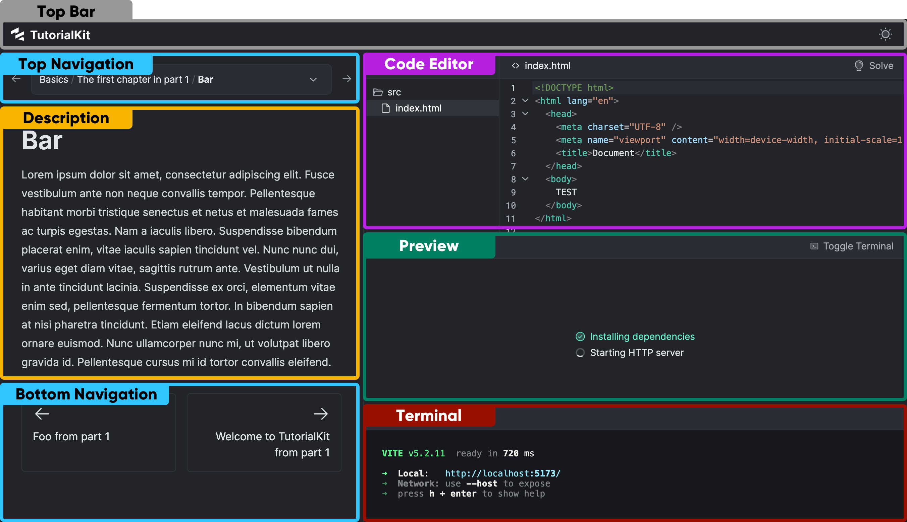

import { Image } from 'astro:assets';
import uiPreviewImage from './images/ui-preview.png';
import uiTerminalImage from './images/ui-terminal.png';
import uiCodeEditorImage from './images/ui-code-editor.png';

This page provides an overview of the terms we use to describe each of the pieces of the TutorialKit's user interface (UI).

### Top Bar

The top bar includes the tutorial logo and the ability to toggle between the dark and light mode.

### Top Navigation

In the top navigation, your user can use the left and right arrow buttons to navigate to the previous or next lesson. A breadcrumb shows the current location in the tutorial (e.g., Part 1 / Chapter 2 / Lesson 1) and clicking it reveals a dropdown menu with the whole tutorial structure, allowing the user to jump to any lesson.

### Bottom Navigation

The bottom navigation displays the titles of the previous and next lessons. Clicking on the title will take you to the respective lesson.

### Description

The lesson description includes the explanation for the current lesson as defined in the lesson's [`content.md` or `content.mdx` file](/guides/creating-content/#a-lesson-content-file). This section can include text, images, code snippets, and other media.

### Code Editor

An interactive code editor is the section where a user can solve the coding challenge of the lesson. The editor includes a tree view of the lesson files where a user can select a file to edit. They can also click the "Solve" button to see the solution and then "Reset" to bring the code to the initial state.

<Image src={uiCodeEditorImage} alt="TutorialKit's Preview" />

Code edits made by a user are automatically picked up by a Preview app's dev server, so there is no need to manually save the file.

### Preview

The preview displays the application which is a result of applying lesson files to the [code template](/guides/creating-content/#code-templates) and running that code.

<Image src={uiPreviewImage} alt="TutorialKit's Preview" />

Before your application template's dev server opens a port with something to be displayed, the preview shows the preparation steps such as "Installing dependencies", "Starting HTTP server" to indicate progress to the user. Note that you can customize these steps for each lesson, chapter or part of the tutorial (see: [prepareCommands](/reference/configuration/#preparecommands) reference).

The preview updates in real-time as the user makes changes to the code, chooses to see the solution or navigates between lessons.

### Terminal

The terminal displays the output of your demo application's dev server.

<Image src={uiTerminalImage} alt="TutorialKit's Terminal" />
