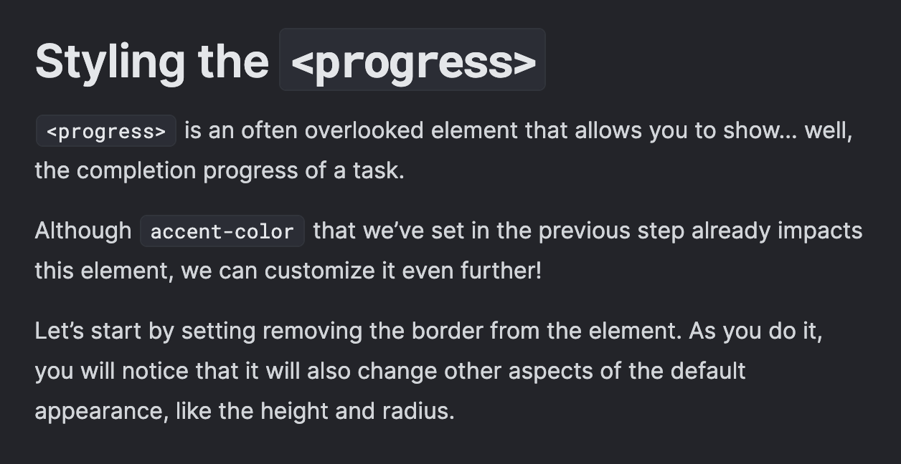
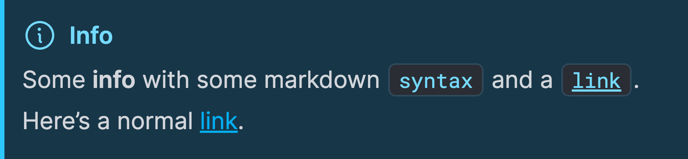
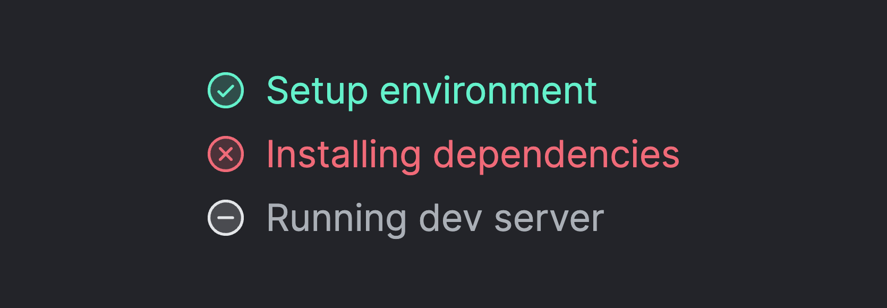
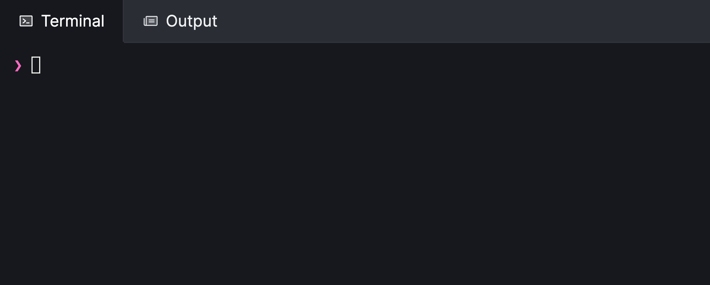
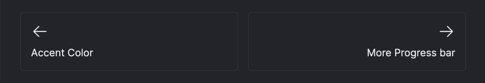
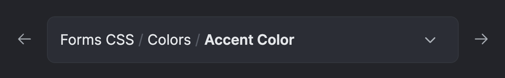
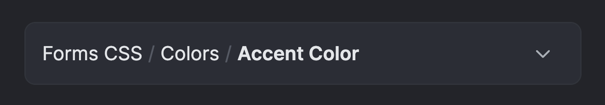
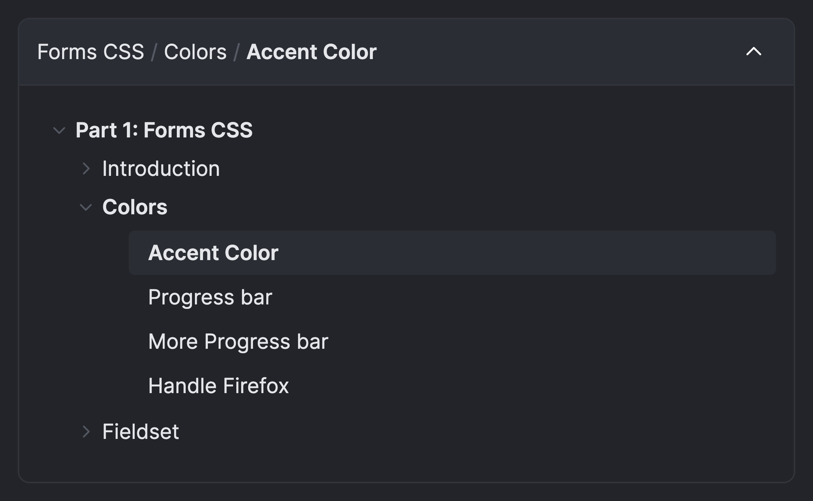
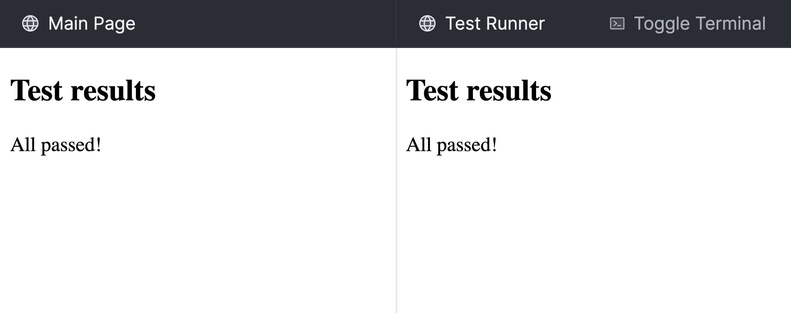
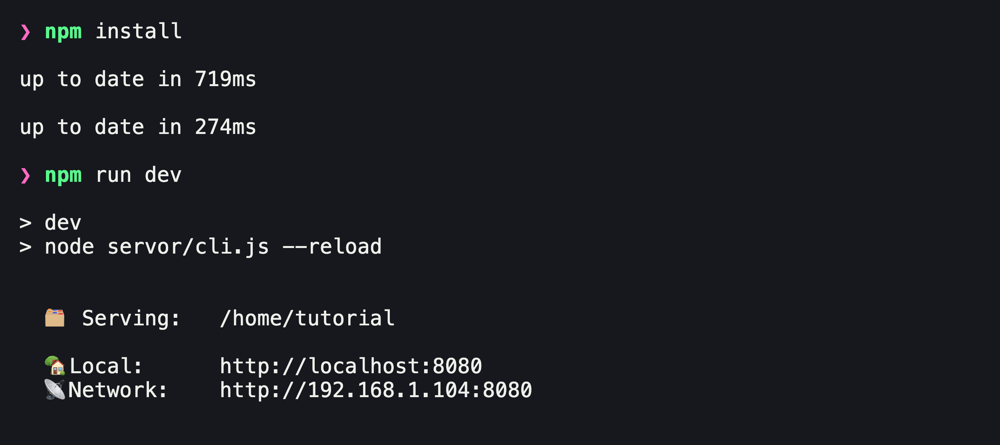

import { Image } from 'astro:assets';
import { Code } from '@astrojs/starlight/components';

import themingContent from './images/theming-content.png';
import themingCallout from './images/theming-callout.png';
import themingPanelHeader from './images/theming-panel-header.png';
import themingFiletree from './images/theming-filetree.png';
import themingFiletreeFile from './images/theming-filetree-file.png';
import themingFileTreeFolder from './images/theming-filetree-folder.png';
import themingEditorGutter from './images/theming-editor-gutter.png';
import themingEditorFoldGutter from './images/theming-editor-gutter-fold.png';
import themingEditorTooltip from './images/theming-editor-tooltip.png';

import themeCSS from '@tutorialkit/astro/default-theme.css?raw';

TutorialKit allows you to customize its appearance to match your brand or preferences. This guide explains how to modify various elements of the interface using CSS variables and file replacements.

## Logo

You can customize the logo in the top left corner of the TutorialKit UI by replacing the `logo.svg` file in the `public` directory of your TutorialKit project. Supported extensions for the logo are `.svg`, `.png`, `.jpg`, and `.jpeg`.

If you want to use a different logo for dark mode, you can add a `logo-dark` file in the `public` directory. This file is optional, and if it's not provided, TutorialKit will use the `logo` file for both light and dark mode.

## Styling

In order to customize the appearance of TutorialKit, you can use CSS variables to change the colors of various elements. To do this, you can create a `theme.css` file at the root of your TutorialKit project and add the CSS variables you want to customize. You need to define the colors for both light and dark mode.

```css
:root[data-theme='light'] {
  /* Light mode colors */
}

:root[data-theme='dark'] {
  /* Dark mode colors */
}
```

Within these two root selectors, you can define any of the CSS variables mentioned in the following sections.

These tokens can be used to style the colors of the tutorial on a high level. For more detailed customization, you can use the tokens for the individual elements.

| Token                                   | Description                                  |
| --------------------------------------- | -------------------------------------------- |
| `--tk-elements-app-textColor`           | The text color of the TutorialKit app.       |
| `--tk-elements-app-backgroundColor`     | The background color of the TutorialKit app. |
| `--tk-elements-app-borderColor`         | The border color of the TutorialKit app.     |

If you want to start with a `theme.css` file that includes all the available CSS variables you can use the following snippet:

<Code code={themeCSS} lang="css" title="theme.css" class="limit-code-height" />

### Links

Tokens used by links.

| Token                                    | Description                                          |
| ---------------------------------------- | ---------------------------------------------------- |
| `--tk-elements-link-primaryColor`        | The text color of the primary links.                 |
| `--tk-elements-link-primaryColorHover`   | The text color of the primary links when hovering.   |
| `--tk-elements-link-secondaryColor`      | The text color of the secondary links.               |
| `--tk-elements-link-secondaryColorHover` | The text color of the secondary links when hovering. |

### Content

The content refers to the main part of the lesson that contains the text and images.



| Token                                    | Description                               |
| ---------------------------------------- | ----------------------------------------- |
| `--tk-elements-content-textColor`        | The text color of the content.            |
| `--tk-elements-content-headingTextColor` | The color of the headings in the content. |

### Callouts

Customize the appearance of each callout type by adjusting its specific style tokens. Each callout includes tokens for elements such as text color, title color, icon color, background, code snippet color, and border color.



#### Tip

| Token                                            | Description                                                 |
| ------------------------------------------------ | ----------------------------------------------------------- |
| `--tk-elements-callouts-tip-textColor`           | The text color for the tip callout.                         |
| `--tk-elements-callouts-tip-titleTextColor`      | The title text color for the tip callout.                   |
| `--tk-elements-callouts-tip-iconColor`           | The icon color for the tip callout.                         |
| `--tk-elements-callouts-tip-backgroundColor`     | The background color for the tip callout.                   |
| `--tk-elements-callouts-tip-codeColor`           | The color for a code snippet in the tip callout.            |
| `--tk-elements-callouts-tip-codeBackgroundColor` | The background color for a code snippet in the tip callout. |
| `--tk-elements-callouts-tip-borderColor`         | The border color for the tip callout.                       |

#### Info

| Token                                             | Description                                                  |
| ------------------------------------------------- | ------------------------------------------------------------ |
| `--tk-elements-callouts-info-textColor`           | The text color for the info callout.                         |
| `--tk-elements-callouts-info-titleTextColor`      | The title text color for the info callout.                   |
| `--tk-elements-callouts-info-iconColor`           | The icon color for the info callout.                         |
| `--tk-elements-callouts-info-backgroundColor`     | The background color for the info callout.                   |
| `--tk-elements-callouts-info-codeColor`           | The color for a code snippet in the info callout.            |
| `--tk-elements-callouts-info-codeBackgroundColor` | The background color for a code snippet in the info callout. |
| `--tk-elements-callouts-info-borderColor`         | The border color for the info callout.                       |

#### Warning

| Token                                                | Description                                                     |
| ---------------------------------------------------- | --------------------------------------------------------------- |
| `--tk-elements-callouts-warning-textColor`           | The text color for the warning callout.                         |
| `--tk-elements-callouts-warning-titleTextColor`      | The title text color for the warning callout.                   |
| `--tk-elements-callouts-warning-iconColor`           | The icon color for the warning callout.                         |
| `--tk-elements-callouts-warning-backgroundColor`     | The background color for the warning callout.                   |
| `--tk-elements-callouts-warning-codeColor`           | The color for a code snippet in the warning callout.            |
| `--tk-elements-callouts-warning-codeBackgroundColor` | The background color for a code snippet in the warning callout. |
| `--tk-elements-callouts-warning-borderColor`         | The border color for the warning callout.                       |

#### Danger

| Token                                               | Description                                                    |
| --------------------------------------------------- | -------------------------------------------------------------- |
| `--tk-elements-callouts-danger-textColor`           | The text color for the danger callout.                         |
| `--tk-elements-callouts-danger-titleTextColor`      | The title text color for the danger callout.                   |
| `--tk-elements-callouts-danger-iconColor`           | The icon color for the danger callout.                         |
| `--tk-elements-callouts-danger-backgroundColor`     | The background color for the danger callout.                   |
| `--tk-elements-callouts-danger-codeColor`           | The color for a code snippet in the danger callout.            |
| `--tk-elements-callouts-danger-codeBackgroundColor` | The background color for a code snippet in the danger callout. |
| `--tk-elements-callouts-danger-borderColor`         | The border color for the danger callout.                       |

#### Success

| Token                                                | Description                                                     |
| ---------------------------------------------------- | --------------------------------------------------------------- |
| `--tk-elements-callouts-success-textColor`           | The text color for the success callout.                         |
| `--tk-elements-callouts-success-titleTextColor`      | The title text color for the success callout.                   |
| `--tk-elements-callouts-success-iconColor`           | The icon color for the success callout.                         |
| `--tk-elements-callouts-success-backgroundColor`     | The background color for the success callout.                   |
| `--tk-elements-callouts-success-codeColor`           | The color for a code snippet in the success callout.            |
| `--tk-elements-callouts-success-codeBackgroundColor` | The background color for a code snippet in the success callout. |
| `--tk-elements-callouts-success-borderColor`         | The border color for the success callout.                       |

### Statuses

The statuses refer to the preview window that shows the status of the [`mainCommand`](/reference/configuration#maincommand) and [`prepareCommands`](/reference/configuration#preparecommands) commands.



#### Positive

| Token                                      | Description                                                        |
| ------------------------------------------ | ------------------------------------------------------------------ |
| `--tk-elements-status-positive-textColor`  | The text color for the positive status.                            |
| `--tk-elements-status-positive-iconColor`  | The icon color for the positive status. Default is the text color. |

#### Negative

| Token                                      | Description                                                        |
| ------------------------------------------ | ------------------------------------------------------------------ |
| `--tk-elements-status-negative-textColor`  | The text color for the negative status.                            |
| `--tk-elements-status-negative-iconColor`  | The icon color for the negative status. Default is the text color. |

#### Skipped

| Token                                     | Description                                                       |
| ----------------------------------------- | ----------------------------------------------------------------- |
| `--tk-elements-status-skipped-textColor`  | The text color for the skipped status.                            |
| `--tk-elements-status-skipped-iconColor`  | The icon color for the skipped status. Default is the text color. |

#### Disabled

| Token                                      | Description                                                        |
| ------------------------------------------ | ------------------------------------------------------------------ |
| `--tk-elements-status-disabled-textColor`  | The text color for the disabled status.                            |
| `--tk-elements-status-disabled-iconColor`  | The icon color for the disabled status. Default is the text color. |

#### Active

| Token                                   | Description                                                      |
| --------------------------------------- | ---------------------------------------------------------------- |
| `--tk-elements-status-active-textColor` | The text color for the active status.                            |
| `--tk-elements-status-active-iconColor` | The icon color for the active status. Default is the text color. |

### Top Bar

The top bar is the element at the top of the page which contains the logo.


| Token                                  | Description                          |
| -------------------------------------- | ------------------------------------ |
| `--tk-elements-topBar-backgroundColor` | The background color of the top bar. |

#### Icon Button

An icon button is a button with only an icon and no text. The color theme switcher in the top bar is an icon button.

| Token                                                  | Description                                             |
| ------------------------------------------------------ | ------------------------------------------------------- |
| `--tk-elements-topBar-iconButton-backgroundColor`      | The background color of the icon button.                |
| `--tk-elements-topBar-iconButton-backgroundColorHover` | The background color of the icon button when hovering.  |
| `--tk-elements-topBar-iconButton-iconColor`            | The color of the icon.                                  |
| `--tk-elements-topBar-iconButton-iconColorHover`       | The color of the icon when hovering.                    |

### Panels

Panels are containers which can be resized and can hold different kind of components. For instance, the file tree or the terminal.

| Token                                      | Description                         |
| ------------------------------------------ | ----------------------------------- |
| `--tk-elements-panel-textColor`            | The text color of the panels.       |
| `--tk-elements-panel-backgroundColor`      | The background color of the panels. |

#### Header

The panel header is the top part of the panel that contains the title, an icon, and optionally an action button.

<Image src={themingPanelHeader} alt="Panel Header" width="342" densities={[2]} />

| Token                                        | Description                          |
| -------------------------------------------- | ------------------------------------ |
| `--tk-elements-panel-header-backgroundColor` | The background color of the header.  |
| `--tk-elements-panel-header-textColor`       | The text color of the header.        |
| `--tk-elements-panel-header-iconColor`       | The color of the icon in the header. |

##### Button

The button in the header is shown at the right side of the header of the panel.


| Token                                                   | Description                                       |
| ------------------------------------------------------- | ------------------------------------------------- |
| `--tk-elements-panel-headerButton-textColor`            | The text color of the button.                     |
| `--tk-elements-panel-headerButton-textColorHover`       | The text color of the button when hovering.       |
| `--tk-elements-panel-headerButton-backgroundColor`      | The background color of the button.               |
| `--tk-elements-panel-headerButton-backgroundColorHover` | The background color of the button when hovering. |
| `--tk-elements-panel-headerButton-iconColor`            | The icon color.                                   |
| `--tk-elements-panel-headerButton-iconColorHover`       | The icon color when hovering.                     |

##### Tab



| Token                                                 | Description                                    |
| ----------------------------------------------------- | ---------------------------------------------- |
| `--tk-elements-panel-headerTab-textColor`             | The text color of the tab.                     |
| `--tk-elements-panel-headerTab-textColorHover`        | The text color of the tab when hovering        |
| `--tk-elements-panel-headerTab-textColorActive`       | The text color of the active tab.              |
| `--tk-elements-panel-headerTab-backgroundColor`       | The background color of the tab.               |
| `--tk-elements-panel-headerTab-backgroundColorHover`  | The background color of the tab when hovering. |
| `--tk-elements-panel-headerTab-backgroundColorActive` | The background color of the active tab.        |
| `--tk-elements-panel-headerTab-borderColor`           | The border color of the tab.                   |
| `--tk-elements-panel-headerTab-borderColorHover`      | The border color of the tab when hovering      |
| `--tk-elements-panel-headerTab-borderColorActive`     | The border color of the active tab.            |
| `--tk-elements-panel-headerTab-iconColor`             | The icon color of the tab.                     |
| `--tk-elements-panel-headerTab-iconColorHover`        | The icon color of the tab when hovering        |
| `--tk-elements-panel-headerTab-iconColorActive`       | The icon color of the active tab.              |

### File Tree

The file tree shows the relevant files of the lesson next to the text editor.

<Image src={themingFiletree} alt="File Tree" width="283" densities={[2]} />

| Token                                         | Description                                                            |
| --------------------------------------------- | ---------------------------------------------------------------------- |
| `--tk-elements-fileTree-textColor`            | The text color of the items in the file tree.                          |
| `--tk-elements-fileTree-textColorHover`       | The text color of the items in the file tree when hovering.            |
| `--tk-elements-fileTree-backgroundColor`      | The background color of the file tree.                                 |
| `--tk-elements-fileTree-backgroundColorHover` | The background color of the items in the file tree when hovering.      |
| `--tk-elements-fileTree-iconColor`            | The color of the icon next to the item in the file tree.               |
| `--tk-elements-fileTree-iconColorHover`       | The color of the icon next to the item in the file tree when hovering. |

#### File

You can customize the appearance of the files in the file tree using the following tokens.

<Image src={themingFiletreeFile} alt="File Tree File" width="342" densities={[2]} />


| Token                                                 | Description                                          |
| ----------------------------------------------------- | ---------------------------------------------------- |
| `--tk-elements-fileTree-file-textColor`               | The text color of the file item.                     |
| `--tk-elements-fileTree-file-textColorHover`          | The text color of the file item when hovering.       |
| `--tk-elements-fileTree-file-textColorSelected`       | The text color of the selected file item.            |
| `--tk-elements-fileTree-file-backgroundColor`         | The background color of the file item.               |
| `--tk-elements-fileTree-file-backgroundColorHover`    | The background color of the file item when hovering. |
| `--tk-elements-fileTree-file-backgroundColorSelected` | The background color of the selected file item.      |
| `--tk-elements-fileTree-file-iconColor`               | The color of the file icon.                          |
| `--tk-elements-fileTree-file-iconColorHover`          | The color of the file icon when hovering.            |
| `--tk-elements-fileTree-file-iconColorSelected`       | The color of the file icon of the selected item.     |

#### Folder

You can customize the appearance of the folders in the file tree using the following tokens.

<Image src={themingFileTreeFolder} alt="File Tree Folder" width="342" densities={[2]} />

| Token                                                | Description                                            |
| ---------------------------------------------------- | ------------------------------------------------------ |
| `--tk-elements-fileTree-folder-textColor`            | The text color of the folder item.                     |
| `--tk-elements-fileTree-folder-textColorHover`       | The text color of the folder item when hovering.       |
| `--tk-elements-fileTree-folder-backgroundColor`      | The background color of the folder item.               |
| `--tk-elements-fileTree-folder-backgroundColorHover` | The background color of the folder item when hovering. |
| `--tk-elements-fileTree-folder-iconColor`            | The color of the folder icon.                          |
| `--tk-elements-fileTree-folder-iconColorHover`       | The color of the folder icon when hovering.            |

### Navigation Card

The navigation cards are the cards at the bottom of a lesson to navigate to the previous and next lesson.



| Token                                        | Description                                                |
| -------------------------------------------- | ---------------------------------------------------------- |
| `--tk-elements-navCard-textColor`            | The text color of the navigation card.                     |
| `--tk-elements-navCard-textColorHover`       | The text color of the navigation card when hovering.       |
| `--tk-elements-navCard-backgroundColor`      | The background color of the navigation card.               |
| `--tk-elements-navCard-backgroundColorHover` | The background color of the navigation card when hovering. |
| `--tk-elements-navCard-borderColor`          | The border color of the navigation card.                   |
| `--tk-elements-navCard-borderColorHover`     | The border color of the navigation card when hovering.     |
| `--tk-elements-navCard-iconColor`            | The icon color of the navigation card.                     |
| `--tk-elements-navCard-iconColorHover`       | The icon color of the navigation card when hovering.       |

### Breadcrumbs

The breadcrumbs are the navigation elements that show the path of the current lesson. The breadcrumbs are divided into multiple parts.



##### Navigation

The navigation elements are the back and forward buttons next to the dropdown at the top of the lesson content.

| Token                                                | Description                                      |
| ---------------------------------------------------- | ------------------------------------------------ |
| `--tk-elements-breadcrumbs-navButton-iconColor`      | The color of the navigation icon.               |
| `--tk-elements-breadcrumbs-navButton-iconColorHover` | The color of the navigation icon when hovering. |

##### Toggle Button

The toggle button shows the current chapter and lesson and can be used to navigate to a different chapter.



| Token                                                             | Description                                                                               |
| ----------------------------------------------------------------- | ----------------------------------------------------------------------------------------- |
| `--tk-elements-breadcrumbs-toggleButton-backgroundColor`          | The background color of the toggle button.                                                |
| `--tk-elements-breadcrumbs-toggleButton-backgroundColorHover`     | The background color of the toggle button when hovering.                                  |
| `--tk-elements-breadcrumbs-toggleButton-backgroundColorSelected`  | The background color of the toggle button when the dropdown is expanded.                  |
| `--tk-elements-breadcrumbs-toggleButton-borderColor`              | The border color of the toggle button.                                                    |
| `--tk-elements-breadcrumbs-toggleButton-borderColorHover`         | The border color of the toggle button when hovering.                                      |
| `--tk-elements-breadcrumbs-toggleButton-borderColorSelected`      | The border color of the toggle button when the dropdown is expanded.                      |
| `--tk-elements-breadcrumbs-toggleButton-textColor`                | The text color of the toggle button.                                                      |
| `--tk-elements-breadcrumbs-toggleButton-textColorHover`           | The text color of the toggle button when hovering.                                        |
| `--tk-elements-breadcrumbs-toggleButton-textColorSelected`        | The text color of the toggle button when the dropdown is expanded.                        |
| `--tk-elements-breadcrumbs-toggleButton-textDividerColor`         | The color of the divider in between the different sections.                               |
| `--tk-elements-breadcrumbs-toggleButton-textDividerColorHover`    | The color of the divider in between the different sections when hovering.                 |
| `--tk-elements-breadcrumbs-toggleButton-textDividerColorSelected` | The color of the divider in between the different sections when the dropdown is expanded. |
| `--tk-elements-breadcrumbs-toggleButton-iconColor`                | The color of the arrow icon.                                                              |
| `--tk-elements-breadcrumbs-toggleButton-iconColorHover`           | The color of the arrow icon when hovering.                                                |
| `--tk-elements-breadcrumbs-toggleButton-iconColorSelected`        | The color of the arrow icon when the dropdown is expanded.                                |

##### Dropdown

The following tokens are used to customize the appearance of the breadcrumb dropdown which is the bottom section of as shown in the image.



| Token                                                              | Description                                                          |
| ------------------------------------------------------------------ | -------------------------------------------------------------------- |
| `--tk-elements-breadcrumbs-dropdown-backgroundColor`               | The background color of the dropdown.                                |
| `--tk-elements-breadcrumbs-dropdown-borderColor`                   | The border color of the toggle button and the dropdown.              |
| `--tk-elements-breadcrumbs-dropdown-textColor`                     | The standard text color of the dropdown.                             |
| `--tk-elements-breadcrumbs-dropdown-textColorHover`                | The standard text color of the dropdown when hovering.               |
| `--tk-elements-breadcrumbs-dropdown-accordionTextColor`            | The text color of the collapsible or expandable title.               |
| `--tk-elements-breadcrumbs-dropdown-accordionTextColorSelected`    | The text color of the selected collapsible or expandable title.      |
| `--tk-elements-breadcrumbs-dropdown-accordionTextColorHover`       | The text color of the collapsible or expandable title when hovering. |
| `--tk-elements-breadcrumbs-dropdown-accordionIconColor`            | The icon color of the collapsible or expandable title.               |
| `--tk-elements-breadcrumbs-dropdown-accordionIconColorSelected`    | The icon color of the selected collapsible or expandable title.      |
| `--tk-elements-breadcrumbs-dropdown-accordionIconColorHover`       | The icon color of the collapsible or expandable title when hovering. |
| `--tk-elements-breadcrumbs-dropdown-lessonBackgroundColor`         | The background color of the lesson.                                  |
| `--tk-elements-breadcrumbs-dropdown-lessonBackgroundColorSelected` | The background color of the selected lesson.                         |
| `--tk-elements-breadcrumbs-dropdown-lessonTextColor`               | The text color of the lesson.                                        |
| `--tk-elements-breadcrumbs-dropdown-lessonTextColorSelected`       | The text color of the selected lesson.                               |
| `--tk-elements-breadcrumbs-dropdown-lessonTextColorHover`          | The text color of the lesson when hoevering.                         |

### Previews

The previews can show one or multiple websites.



| Token                                | Description                                         |
| ------------------------------------ | --------------------------------------------------- |
| `--tk-elements-previews-borderColor` | The color of the borders between multiple previews. |

### Editor

The editor is an important part of TutorialKit as it allows you to write and edit code.


| Token                                                      | Description                                                     |
| ---------------------------------------------------------- | --------------------------------------------------------------- |
| `--tk-elements-editor-textColor`                           | The text color of the editor.                                   |
| `--tk-elements-editor-backgroundColor`                     | The background color of the editor.                             |
| `--tk-elements-editor-activeLineBackgroundColor`           | The background color of the active line in the editor.          |
| `--tk-elements-editor-cursorColor`                         | The color of the cursor.                                        |
| `--tk-elements-editor-matchingBracketBackgroundColor`      | The background color of the matching bracket.                   |
| `--tk-elements-editor-panels-borderColor`                  | The border color between different panels inside the editor.    |
| `--tk-elements-editor-selection-backgroundColor`           | The background color of selected text in the editor.            |
| `--tk-elements-editor-selection-backgroundOpacity`         | The background opacity of selected text in the editor.          |
| `--tk-elements-editor-selection-inactiveBackgroundColor`   | The background color of inactive selected text in the editor.   |
| `--tk-elements-editor-selection-inactiveBackgroundOpacity` | The background opacity of inactive selected text in the editor. |

#### Gutter

The gutter refers to the area on the left side of the editor that shows line numbers and other information.

<Image src={themingEditorGutter} alt="Editor Gutter" width="65" densities={[2]} />

| Token                                             | Description                                      |
| ------------------------------------------------- | ------------------------------------------------ |
| `--tk-elements-editor-gutter-textColor`           | The text color of the gutter.                    |
| `--tk-elements-editor-gutter-backgroundColor`     | The background color of the gutter.              |
| `--tk-elements-editor-gutter-activeLineTextColor` | The text color of the gutter on the active line. |

#### Fold Gutter

The fold gutter is part of the gutter, and is the area next to it that shows the folding icons.

<Image src={themingEditorFoldGutter} alt="Editor Fold Gutter" width="28" densities={[2]} />

| Token                                            | Description                                                                  |
| ------------------------------------------------ | ---------------------------------------------------------------------------- |
| `--tk-elements-editor-foldGutter-textColor`      | The text color of the fold gutter.                                           |
| `--tk-elements-editor-foldGutter-textColorHover` | The text color of the fold gutter when hovering over an item in that gutter. |

#### Search

The search panel is the panel that shows up when you search text in the editor.


| Token                                                          | Description                                                                 |
| -------------------------------------------------------------- | --------------------------------------------------------------------------- |
| `--tk-elements-editor-search-textColor`                        | The text color of the search panel.                                         |
| `--tk-elements-editor-search-backgroundColor`                  | The background color of the search panel.                                   |
| `--tk-elements-editor-search-closeButton-textColor`            | The text color of the close button in the search panel.                     |
| `--tk-elements-editor-search-closeButton-textColorHover`       | The text color of the close button in the search panel when hovering.       |
| `--tk-elements-editor-search-closeButton-backgroundColor`      | The background color of the close button in the search panel.               |
| `--tk-elements-editor-search-closeButton-backgroundColorHover` | The background color of the close button in the search panel when hovering. |
| `--tk-elements-editor-search-button-textColor`                 | The text color of the buttons in the search panel.                          |
| `--tk-elements-editor-search-button-textColorHover`            | The text color of the buttons in the search panel when hovering.            |
| `--tk-elements-editor-search-button-backgroundColor`           | The background color of the buttons in the search panel.                    |
| `--tk-elements-editor-search-button-backgroundColorHover`      | The background color of the buttons in the search panel when hovering.      |
| `--tk-elements-editor-search-button-borderColor`               | The border color of the buttons in the search panel.                        |
| `--tk-elements-editor-search-button-borderColorHover`          | The border color of the buttons in the search panel when hovering.          |
| `--tk-elements-editor-search-button-borderColorFocused`        | The border color of the buttons in the search panel when focused.           |
| `--tk-elements-editor-search-input-backgroundColor`            | The background color of the search input field.                             |
| `--tk-elements-editor-search-input-borderColor`                | The border color of the search input field.                                 |
| `--tk-elements-editor-search-input-borderColorFocused`         | The border color of the search input field when focused.                    |

#### Tooltip

The tooltip is the small popup that shows up when you hover over an item or when the editor shows suggestions when autocompleting code.

<Image src={themingEditorTooltip} alt="Editor Tooltip" width="336" densities={[2]} />

| Token                                                  | Description                                               |
| ------------------------------------------------------ | --------------------------------------------------------- |
| `--tk-elements-editor-tooltip-textColor`               | The text color of the tooltip.                            |
| `--tk-elements-editor-tooltip-textColorSelected`       | The text color of the selected item in the tooltip.       |
| `--tk-elements-editor-tooltip-backgroundColor`         | The background color of the tooltip.                      |
| `--tk-elements-editor-tooltip-backgroundColorSelected` | The background color of the selected item in the tooltip. |
| `--tk-elements-editor-tooltip-borderColor`             | The border color of the tooltip.                          |

### Terminal

The terminal refers to both a [read-only and an interactive terminal](/reference/configuration#terminal).



| Token                                              | Description                                            |
| -------------------------------------------------- | ------------------------------------------------------ |
| `--tk-elements-terminal-backgroundColor`           | The background color of the terminal.                  |
| `--tk-elements-terminal-textColor`                 | The text color of the terminal.                        |
| `--tk-elements-terminal-cursorColor`               | The color of the terminal cursor.                      |
| `--tk-elements-terminal-selection-backgroundColor` | The background color of selected text in the terminal. |
| `--tk-elements-terminal-color-black`               | The color of black text in the terminal.               |
| `--tk-elements-terminal-color-red`                 | The color of red text in the terminal.                 |
| `--tk-elements-terminal-color-green`               | The color of green text in the terminal.               |
| `--tk-elements-terminal-color-yellow`              | The color of yellow text in the terminal.              |
| `--tk-elements-terminal-color-blue`                | The color of blue text in the terminal.                |
| `--tk-elements-terminal-color-magenta`             | The color of magenta text in the terminal.             |
| `--tk-elements-terminal-color-cyan`                | The color of cyan text in the terminal.                |
| `--tk-elements-terminal-color-white`               | The color of white text in the terminal.               |
| `--tk-elements-terminal-color-brightBlack`         | The color of bright black text in the terminal.        |
| `--tk-elements-terminal-color-brightRed`           | The color of bright red text in the terminal.          |
| `--tk-elements-terminal-color-brightGreen`         | The color of bright green text in the terminal.        |
| `--tk-elements-terminal-color-brightYellow`        | The color of bright yellow text in the terminal.       |
| `--tk-elements-terminal-color-brightBlue`          | The color of bright blue text in the terminal.         |
| `--tk-elements-terminal-color-brightMagenta`       | The color of bright magenta text in the terminal.      |
| `--tk-elements-terminal-color-brightCyan`          | The color of bright cyan text in the terminal.         |
| `--tk-elements-terminal-color-brightWhite`         | The color of bright white text in the terminal.        |
