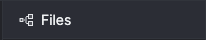
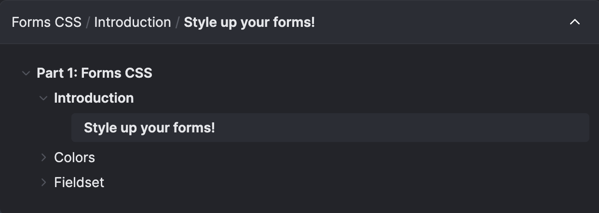

This page describes how to customize the appearance of TutorialKit.

## Logo

You can customize the logo in the top left corner of the TutorialKit UI by replacing the `logo.svg` file in the `public` directory of your TutorialKit project. Supported extensions for the logo are `.svg`, `.png`, `.jpg`, and `.jpeg`.

If you want to use a different logo for dark mode, you can add a `logo-dark` file in the `public` directory. This file is optional, and if it's not provided, TutorialKit will use the `logo` file for both light and dark mode.

## Styling

In order to customize the appearance of TutorialKit, you can use CSS variables to change the colors of various elements. To do this, you can create a `theme.css` file at the root of your TutorialKit project and add the CSS variables you want to customize. You need to define the colors for both light and dark mode.

```css
:root[data-theme='light'] {
  /* Light mode colors */
}

:root[data-theme='dark'] {
  /* Dark mode colors */
}
```

Withing these two root selectors, you can define any of the CSS variables mentioned in the following sections.

These tokens can be used to style the colors of the tutorial on a high level. For more detailed customization, you can use the tokens for the individual elements.

| Token                                   | Description                                  |
| --------------------------------------- | -------------------------------------------- |
| `--tk-elements-app-textColor`           | The text color of the TutorialKit app.       |
| `--tk-elements-app-backgroundColor`     | The background color of the TutorialKit app. |
| `--tk-elements-app-borderColor`         | The border color of the TutorialKit app.     |
| `--tk-elements-app-linkColor`           | The link color of the TutorialKit app.       |


### Content

The content refers to the main part of the lesson that contains the text and images.


| Token                                    | Description                               |
| ---------------------------------------- | ----------------------------------------- |
| `--tk-elements-content-textColor`        | The text color of the content.            |
| `--tk-elements-content-headingTextColor` | The color of the headings in the content. |


### Callouts

Callouts are visual elements used to draw attention to specific information or provide additional context within a document or user interface. They are typically used to highlight important tips, warnings, or other types of messages.

For instanceof, here's an example of an info callout.


#### Tip

| Token                                            | Description                                                 |
| ------------------------------------------------ | ----------------------------------------------------------- |
| `--tk-elements-callouts-tip-textColor`           | The text color for the tip callout.                         |
| `--tk-elements-callouts-tip-titleTextColor`      | The title text color for the tip callout.                   |
| `--tk-elements-callouts-tip-iconColor`           | The icon color for the tip callout.                         |
| `--tk-elements-callouts-tip-backgroundColor`     | The background color for the tip callout.                   |
| `--tk-elements-callouts-tip-codeColor`           | The color for a code snippet in the tip callout.            |
| `--tk-elements-callouts-tip-codeBackgroundColor` | The background color for a code snippet in the tip callout. |
| `--tk-elements-callouts-tip-borderColor`         | The border color for the tip callout.                       |

#### Info

| Token                                             | Description                                                  |
| ------------------------------------------------- | ------------------------------------------------------------ |
| `--tk-elements-callouts-info-textColor`           | The text color for the info callout.                         |
| `--tk-elements-callouts-info-titleTextColor`      | The title text color for the info callout.                   |
| `--tk-elements-callouts-info-iconColor`           | The icon color for the info callout.                         |
| `--tk-elements-callouts-info-backgroundColor`     | The background color for the info callout.                   |
| `--tk-elements-callouts-info-codeColor`           | The color for a code snippet in the info callout.            |
| `--tk-elements-callouts-info-codeBackgroundColor` | The background color for a code snippet in the info callout. |
| `--tk-elements-callouts-info-borderColor`         | The border color for the info callout.                       |

#### Warning

| Token                                                | Description                                                     |
| ---------------------------------------------------- | --------------------------------------------------------------- |
| `--tk-elements-callouts-warning-textColor`           | The text color for the warning callout.                         |
| `--tk-elements-callouts-warning-titleTextColor`      | The title text color for the warning callout.                   |
| `--tk-elements-callouts-warning-iconColor`           | The icon color for the warning callout.                         |
| `--tk-elements-callouts-warning-backgroundColor`     | The background color for the warning callout.                   |
| `--tk-elements-callouts-warning-codeColor`           | The color for a code snippet in the warning callout.            |
| `--tk-elements-callouts-warning-codeBackgroundColor` | The background color for a code snippet in the warning callout. |
| `--tk-elements-callouts-warning-borderColor`         | The border color for the warning callout.                       |

#### Danger

| Token                                               | Description                                                    |
| --------------------------------------------------- | -------------------------------------------------------------- |
| `--tk-elements-callouts-danger-textColor`           | The text color for the danger callout.                         |
| `--tk-elements-callouts-danger-titleTextColor`      | The title text color for the danger callout.                   |
| `--tk-elements-callouts-danger-iconColor`           | The icon color for the danger callout.                         |
| `--tk-elements-callouts-danger-backgroundColor`     | The background color for the danger callout.                   |
| `--tk-elements-callouts-danger-codeColor`           | The color for a code snippet in the danger callout.            |
| `--tk-elements-callouts-danger-codeBackgroundColor` | The background color for a code snippet in the danger callout. |
| `--tk-elements-callouts-danger-borderColor`         | The border color for the danger callout.                       |

#### Success

| Token                                                | Description                                                     |
| ---------------------------------------------------- | --------------------------------------------------------------- |
| `--tk-elements-callouts-success-textColor`           | The text color for the success callout.                         |
| `--tk-elements-callouts-success-titleTextColor`      | The title text color for the success callout.                   |
| `--tk-elements-callouts-success-iconColor`           | The icon color for the success callout.                         |
| `--tk-elements-callouts-success-backgroundColor`     | The background color for the success callout.                   |
| `--tk-elements-callouts-success-codeColor`           | The color for a code snippet in the success callout.            |
| `--tk-elements-callouts-success-codeBackgroundColor` | The background color for a code snippet in the success callout. |
| `--tk-elements-callouts-success-borderColor`         | The border color for the success callout.                       |


### Statuses

The statuses refer to the preview window that shows the status of the [`mainCommand`](../configuration#maincommand) and [`prepareCommands`](../configuration#preparecommands) commands.


#### Positive

| Token                                      | Description                                               |
| ------------------------------------------ | --------------------------------------------------------- |
| `--tk-elements-status-positive-textColor`  | Text color for positive status.                           |
| `--tk-elements-status-positive-iconColor`  | Icon color for positive status. Default is the text color |

#### Negative

| Token                                      | Description                                               |
| ------------------------------------------ | --------------------------------------------------------- |
| `--tk-elements-status-negative-textColor`  | Text color for negative status.                           |
| `--tk-elements-status-negative-iconColor`  | Icon color for negative status. Default is the text color |

#### Skipped

| Token                                      | Description                                              |
| ------------------------------------------ | -------------------------------------------------------- |
| `--tk-elements-status-skipped-textColor`   | Text color for skipped status.                           |
| `--tk-elements-status-skipped-iconColor`   | Icon color for skipped status. Default is the text color |

#### Disabled

| Token                                      | Description                                               |
| ------------------------------------------ | --------------------------------------------------------- |
| `--tk-elements-status-disabled-textColor`  | Text color for disabled status.                           |
| `--tk-elements-status-disabled-iconColor`  | Icon color for disabled status. Default is the text color |

#### Active

| Token                                      | Description                                             |
| ------------------------------------------ | ------------------------------------------------------- |
| `--tk-elements-status-active-textColor`    | Text color for active status.                           |
| `--tk-elements-status-active-iconColor`    | Icon color for active status. Default is the text color |


### Top Bar

The top bar is the element at the top of the page which contains the logo.


| Token                                  | Description                          |
| -------------------------------------- | ------------------------------------ |
| `--tk-elements-topBar-backgroundColor` | The background color of the top bar. |

#### Icon Button

An icon button is a button with only an icon and no text. The color theme switcher in the top bar is an icon button.

| Token                                                  | Description                                             |
| ------------------------------------------------------ | ------------------------------------------------------- |
| `--tk-elements-topBar-iconButton-backgroundColor`      | The background color of the icon button.                |
| `--tk-elements-topBar-iconButton-backgroundColorHover` | The background color of the icon button when hovering.  |
| `--tk-elements-topBar-iconButton-iconColor`            | The color of the icon.                                  |
| `--tk-elements-topBar-iconButton-iconColorHover`       | The color of the icon when hovering.                    |


### Panels

Panels are containers which can be resized and can hold different kind of components. For instanceof, the file tree, or the terminal.

| Token                                      | Description                         |
| ------------------------------------------ | ----------------------------------- |
| `--tk-elements-panel-textColor`            | The text color of the panels.       |
| `--tk-elements-panel-backgroundColor`      | The background color of the panels. |

#### Header

The panel header is the top part of the panel that contains the title, an icon, and optionally an action button



| Token                                        | Description                          |
| -------------------------------------------- | ------------------------------------ |
| `--tk-elements-panel-header-backgroundColor` | The background color of the header.  |
| `--tk-elements-panel-header-textColor`       | The text color of the header.        |
| `--tk-elements-panel-header-iconColor`       | The color of the icon in the header. |

##### Button

The button in the header is shown at the right side of the header of the panel.


| Token                                                   | Description                                       |
| ------------------------------------------------------- | ------------------------------------------------- |
| `--tk-elements-panel-headerButton-textColor`            | The text color of the button.                     |
| `--tk-elements-panel-headerButton-textColorHover`       | The text color of the button when hovering.       |
| `--tk-elements-panel-headerButton-backgroundColor`      | The background color of the button.               |
| `--tk-elements-panel-headerButton-backgroundColorHover` | The background color of the button when hovering. |
| `--tk-elements-panel-headerButton-iconColor`            | The icon color.                                   |
| `--tk-elements-panel-headerButton-iconColorHover`       | The icon color when hovering.                     |

##### Tab


| Token                                                 | Description                                    |
| ----------------------------------------------------- | ---------------------------------------------- |
| `--tk-elements-panel-headerTab-textColor`             | The text color of the tab.                     |
| `--tk-elements-panel-headerTab-textColorHover`        | The text color of the tab when hovering        |
| `--tk-elements-panel-headerTab-textColorActive`       | The text color of the active tab.              |
| `--tk-elements-panel-headerTab-backgroundColor`       | The background color of the tab.               |
| `--tk-elements-panel-headerTab-backgroundColorHover`  | The background color of the tab when hovering. |
| `--tk-elements-panel-headerTab-backgroundColorActive` | The background color of the active tab.        |
| `--tk-elements-panel-headerTab-borderColor`           | The border color of the tab.                   |
| `--tk-elements-panel-headerTab-borderColorHover`      | The border color of the tab when hovering      |
| `--tk-elements-panel-headerTab-borderColorActive`     | The border color of the active tab.            |
| `--tk-elements-panel-headerTab-iconColor`             | The icon color of the tab.                     |
| `--tk-elements-panel-headerTab-iconColorHover`        | The icon color of the tab when hovering        |
| `--tk-elements-panel-headerTab-iconColorActive`       | The icon color of the active tab.              |


### File Tree

The file tree shows the relevant files of the lesson next to the text editor.


| Token                                         | Description                                                            |
| --------------------------------------------- | ---------------------------------------------------------------------- |
| `--tk-elements-fileTree-textColor`            | The text color of the items in the file tree.                          |
| `--tk-elements-fileTree-textColorHover`       | The text color of the items in the file tree when hovering.            |
| `--tk-elements-fileTree-backgroundColor`      | The background color of the file tree.                                 |
| `--tk-elements-fileTree-backgroundColorHover` | The background color of the items in the file tree when hovering.      |
| `--tk-elements-fileTree-iconColor`            | The color of the icon next to the item in the file tree.               |
| `--tk-elements-fileTree-iconColorHover`       | The color of the icon next to the item in the file tree when hovering. |

#### File

You can customize the appearance of the files in the file tree using the following tokens.

| Token                                                 | Description                                          |
| ----------------------------------------------------- | ---------------------------------------------------- |
| `--tk-elements-fileTree-file-textColor`               | The text color of the file item.                     |
| `--tk-elements-fileTree-file-textColorHover`          | The text color of the file item when hovering.       |
| `--tk-elements-fileTree-file-textColorSelected`       | The text color of the selected file item.            |
| `--tk-elements-fileTree-file-backgroundColor`         | The background color of the file item.               |
| `--tk-elements-fileTree-file-backgroundColorHover`    | The background color of the file item when hovering. |
| `--tk-elements-fileTree-file-backgroundColorSelected` | The background color of the selected file item.      |
| `--tk-elements-fileTree-file-iconColor`               | The color of the file icon.                          |
| `--tk-elements-fileTree-file-iconColorHover`          | The color of the file icon when hovering.            |
| `--tk-elements-fileTree-file-iconColorSelected`       | The color of the file icon of the selected item.     |

#### Folder

You can customize the appearance of the folders in the file tree using the following tokens.

| Token                                                | Description                                            |
| ---------------------------------------------------- | ------------------------------------------------------ |
| `--tk-elements-fileTree-folder-textColor`            | The text color of the folder item.                     |
| `--tk-elements-fileTree-folder-textColorHover`       | The text color of the folder item when hovering.       |
| `--tk-elements-fileTree-folder-backgroundColor`      | The background color of the folder item.               |
| `--tk-elements-fileTree-folder-backgroundColorHover` | The background color of the folder item when hovering. |
| `--tk-elements-fileTree-folder-iconColor`            | The color of the folder icon.                          |
| `--tk-elements-fileTree-folder-iconColorHover`       | The color of the folder icon when hovering.            |


### Navigation Card

The navigation cards are the cards at the bottom of a lesson to navigate to the previous and next lesson.


| Token                                        | Description                                                 |
| -------------------------------------------- | ----------------------------------------------------------- |
| `--tk-elements-navCard-textColor`            | The text color for the navigation card.                     |
| `--tk-elements-navCard-textColorHover`       | The text color for the navigation card when hovering.       |
| `--tk-elements-navCard-backgroundColor`      | The background color for the navigation card.               |
| `--tk-elements-navCard-backgroundColorHover` | The background color for the navigation card when hovering. |
| `--tk-elements-navCard-borderColor`          | The border color for the navigation card.                   |
| `--tk-elements-navCard-borderColorHover`     | The border color for the navigation card when hovering.     |
| `--tk-elements-navCard-iconColor`            | The icon color for the navigation card.                     |
| `--tk-elements-navCard-iconColorHover`       | The icon color for the navigation card when hovering.       |


### Breadcrumbs

The breadcrumbs are the navigation elements that show the path of the current lesson. The breadcrumbs are divided into multiple parts.


##### Navigation

The navigation elements are the back and forward buttons next to the dropdown at the top of the lesson content.

| Token                                                | Description                                      |
| ---------------------------------------------------- | ------------------------------------------------ |
| `--tk-elements-breadcrumbs-navButton-iconColor`      | The color for the navigation icon.               |
| `--tk-elements-breadcrumbs-navButton-iconColorHover` | The color for the navigation icon when hovering. |

##### Toggle Button

The toggle button shows the current chapter and lesson and can be used to navigate to a different chapter.


| Token                                                             | Description                                                                            |
| ----------------------------------------------------------------- | -------------------------------------------------------------------------------------- |
| `--tk-elements-breadcrumbs-toggleButton-backgroundColor`          | Background color for the toggle button.                                                |
| `--tk-elements-breadcrumbs-toggleButton-backgroundColorHover`     | Background color for the toggle button when hovering.                                  |
| `--tk-elements-breadcrumbs-toggleButton-backgroundColorSelected`  | Background color for the toggle button when the dropdown is expanded.                  |
| `--tk-elements-breadcrumbs-toggleButton-borderColor`              | Border color for the toggle button.                                                    |
| `--tk-elements-breadcrumbs-toggleButton-borderColorHover`         | Border color for the toggle button when hovering.                                      |
| `--tk-elements-breadcrumbs-toggleButton-borderColorSelected`      | Border color for the toggle button when the dropdown is expanded.                      |
| `--tk-elements-breadcrumbs-toggleButton-textColor`                | Text color for the toggle button.                                                      |
| `--tk-elements-breadcrumbs-toggleButton-textColorHover`           | Text color for the toggle button when hovering                                         |
| `--tk-elements-breadcrumbs-toggleButton-textColorSelected`        | Text color for the toggle button when the dropdown is expanded.                        |
| `--tk-elements-breadcrumbs-toggleButton-textDividerColor`         | Color for the divider in between the different sections.                               |
| `--tk-elements-breadcrumbs-toggleButton-textDividerColorHover`    | Color for the divider in between the different sections when hovering.                 |
| `--tk-elements-breadcrumbs-toggleButton-textDividerColorSelected` | Color for the divider in between the different sections when the dropdown is expanded. |
| `--tk-elements-breadcrumbs-toggleButton-iconColor`                | Color for the arrow icon.                                                              |
| `--tk-elements-breadcrumbs-toggleButton-iconColorHover`           | Color for the arrow icon when hovering.                                                |
| `--tk-elements-breadcrumbs-toggleButton-iconColorSelected`        | Color for the arrow icon when the dropdown is expanded                                 |

##### Dropdown

The following tokens are used to customize the appearance of the breadcrumb dropdown which is the bottom section of as shown in the image.



| Token                                                              | Description                                                      |
| ------------------------------------------------------------------ | ---------------------------------------------------------------- |
| `--tk-elements-breadcrumbs-dropdown-backgroundColor`               | Background color for the dropdown.                               |
| `--tk-elements-breadcrumbs-dropdown-borderColor`                   | Border color between the toggle button and the dropdown.         |
| `--tk-elements-breadcrumbs-dropdown-textColor`                     | Standard text color for dropdown.                                |
| `--tk-elements-breadcrumbs-dropdown-textColorHover`                | Text color on hover for breadcrumb dropdown.                     |
| `--tk-elements-breadcrumbs-dropdown-accordionTextColor`            | Text color for the collapsible or expandable title.              |
| `--tk-elements-breadcrumbs-dropdown-accordionTextColorSelected`    | Text color for the selected collapsable or expandable title.     |
| `--tk-elements-breadcrumbs-dropdown-accordionTextColorHover`       | Text color when hovering over a collapsable or expandable title. |
| `--tk-elements-breadcrumbs-dropdown-accordionIconColor`            | Icon color for the collapsable or expandable title.              |
| `--tk-elements-breadcrumbs-dropdown-accordionIconColorSelected`    | Icon colorfor the selected collapsable or expandable title.      |
| `--tk-elements-breadcrumbs-dropdown-accordionIconColorHover`       | Icon color when hovering over a collapsable or expandable title. |
| `--tk-elements-breadcrumbs-dropdown-lessonBackgroundColor`         | Background color for the lesson.                                 |
| `--tk-elements-breadcrumbs-dropdown-lessonBackgroundColorSelected` | Background color for the selected lesson.                        |
| `--tk-elements-breadcrumbs-dropdown-lessonTextColor`               | Text color for the lesson.                                       |
| `--tk-elements-breadcrumbs-dropdown-lessonTextColorSelected`       | Text color for the selected lesson.                              |
| `--tk-elements-breadcrumbs-dropdown-lessonTextColorHover`          | Text color when hovering over a lesson.                          |


### Previews

The previews can show one or multiple websites.


| Token                                | Description                                         |
| ------------------------------------ | --------------------------------------------------- |
| `--tk-elements-previews-borderColor` | The color of the borders between multiple previews. |


### Terminal

The terminal refers to both a [read-only and an interactive terminal](../configuration#terminal).


| Token                                              | Description                                           |
| -------------------------------------------------- | ----------------------------------------------------- |
| `--tk-elements-terminal-backgroundColor`           | Background color of the terminal.                     |
| `--tk-elements-terminal-textColor`                 | Text color of the terminal.                           |
| `--tk-elements-terminal-cursorColor`               | Color of the terminal cursor.                         |
| `--tk-elements-terminal-selection-backgroundColor` | Background color of selected text in the terminal.    |
| `--tk-elements-terminal-color-black`               | Color for black text in the terminal.                 |
| `--tk-elements-terminal-color-red`                 | Color for red text in the terminal.                   |
| `--tk-elements-terminal-color-green`               | Color for green text in the terminal.                 |
| `--tk-elements-terminal-color-yellow`              | Color for yellow text in the terminal.                |
| `--tk-elements-terminal-color-blue`                | Color for blue text in the terminal.                  |
| `--tk-elements-terminal-color-magenta`             | Color for magenta text in the terminal.               |
| `--tk-elements-terminal-color-cyan`                | Color for cyan text in the terminal.                  |
| `--tk-elements-terminal-color-white`               | Color for white text in the terminal.                 |
| `--tk-elements-terminal-color-brightBlack`         | Color for bright black text in the terminal.          |
| `--tk-elements-terminal-color-brightRed`           | Color for bright red text in the terminal.            |
| `--tk-elements-terminal-color-brightGreen`         | Color for bright green text in the terminal.          |
| `--tk-elements-terminal-color-brightYellow`        | Color for bright yellow text in the terminal.         |
| `--tk-elements-terminal-color-brightBlue`          | Color for bright blue text in the terminal.           |
| `--tk-elements-terminal-color-brightMagenta`       | Color for bright magenta text in the terminal.        |
| `--tk-elements-terminal-color-brightCyan`          | Color for bright cyan text in the terminal.           |
| `--tk-elements-terminal-color-brightWhite`         | Color for bright white text in the terminal.          |
